# Texas holdem Rank Card Evaluator

[](https://forthebadge.com) [](https://forthebadge.com)

[](https://travis-ci.org/joemccann/dillinger)

Texas Holdem Rank Evaluator Algorithm made in C#. And also a Side Pots Calculator and its algorithm with in-depth explanation, examples and the math behind.

  - A system that gives a rank to a 7 cards hand.
  - Side pots calculator including money spreading
  - In-depth explenation with examples and pictures.

# Demonstration


What we see in the example above is the unification of the cards that are on the table with the cards each player has.

Then, we run a pre-evaluator that will give us initial information about the same cards as the highest card, how many cards are in the sequence, how many have the same color, etc.

And then, in the last step, we will look into which Rank Group belongs to and then the cards in that group will be evaluated.


**A full example:**

```csharp
static void Main(string[] args)
{
	// Suits: club (♣), diamond (♦), heart (♥) and spade (♠).
	Room room = new Room
	{
		RoomName = "Test Room",
		CardsOnTable = new List<string[]>
		{
			new string[]{"14", "Club"},
			new string[]{"13", "Club"}, 
			new string[]{"11", "Club"},
			new string[]{"5", "Club"},
			new string[]{"10", "Heart" }
		}
	};

	ApplicationUser user1 = new ApplicationUser
	{
		Name = "A",
		PlayerCards = new List<string[]>
		{
			new string[]{"8", "Club"},
			new string[]{"7", "Heart"},
		},
		Chips = 0
	};

	ApplicationUser user2 = new ApplicationUser
	{
		Name = "B",
		PlayerCards = new List<string[]>
		{
			new string[]{"9", "Heart"},
			new string[]{"5", "Heart"},
		},
		Chips = 0
	};

	ApplicationUser user3 = new ApplicationUser
	{
		Name = "C",
		PlayerCards = new List<string[]>
		{
			new string[]{"14", "Diamond"},
			new string[]{"4", "Spade"},
		},
		Chips = 0
	};

	ApplicationUser user4 = new ApplicationUser
	{
		Name = "D",
		PlayerCards = new List<string[]>
		{
			new string[]{"14", "Spade"},
			new string[]{"3", "Heart"},
		},
		Chips = 0
	};

	room.Chair0 = user1;
	room.Chair2 = user2;
	room.Chair3 = user3;
	room.Chair4 = user4;

	room.PotOfChair0 = 25;
	room.PotOfChair2 = 50;
	room.PotOfChair3 = 100;
	room.PotOfChair4 = 100;


	var result = room.SpreadMoneyToWinners();

	Console.WriteLine(result);
	Console.ReadKey();

}
```

# In-depth explanation

## `EvaluateRankByHighestCards()` method

If we put aside different end cases for a moment, the main problem with solving the card evaluation problem is as follows:
We want a player with higher card to win players with less good cards,
and in the case of tie we will move on to look at the next card and so on.

However, we don't want to make comparisons every time, so we want to work with a method of assessment and scoring for each player's hand instead.

### Simplifying the problem

Given a `K` **sorted** arrays with integers between 2 and 14, score it so values with high indexes will always be preferred on lower ones.
For example:

`[2,2,2,2,14]` will be preferred on `[12,12,12,12,13]` or `[13,13,13,13,13]` and in case of tie, we'll check the next number,

so for example: `[3,4,6,8,10]` wins `[4,4,5,8,10]` - if we take a look on the first and second numbers: 10 and 8, they both the same but when we take a look on the next number so 6 > 5 and that's why the 1st one will have better score.

### Reduction to base-13 number

Essentially we are describing a base-13 number. Each "digit" (array position) represents one of 13 distinct, ordered values.

We can calculate a ranking by converting the array to a 5 digit, base 13 value:

- Subtract 2 from each array element's value to normalize the element value to the range 0..12.
- Give each array element a score:


- We would actually want to power 13 by `Array.Length - Index` instead of `Index` because the most significant numbers placed on the higher indices.

**Method's Parameters:**

* `cards : List<string[]>` - the list of the cards, already sorted by their value.
* `excludeCardValue : int`, `excludeCardValue2 : int` - in some cases, we'll see that we don't need to check every single card, and in that way we can ignore some of them.
* `limitCheck : int` - in some cases, we would like to check only certain amount of cards.
* `normalize : double` - we would like the `score` of each hand to be `GroupScore` + `SubGroupScore` while SubGroupScore should be between [0,100], to make sure it will happen we need some sort of normalization variable.

## `GroupScore` and `SubGroupScore` evaluation

Some highlights that need to be made when evaluating the playing cards:

1. We need to give a rating to the group to which the cards belong, such as Straight or Two Pairs.
2. When the primary group is selected, it is necessary to evaluate how good the cards are within that group, in case some players will have the same primary group and we will need to evaluate within the same group of cards.
3. We will begin by examining the stronger groups first, and then only the weak ones because some of the weak ones are included in the weaks, such as Full House consists of Pair and Three of a Kind.

### Royal Flush `900`

The easier situation to be checked because the cards are constant, we need to check that the values are: 10, J, K, Q, A
and the suits of every one of those cards equal identical.

### Straight Flush `Group Range: [800, 900)`

We'll go through every suit and check if its count bigger than 4, if it does, we'll make another check if the numbers are in ascending order.

**Edge case:**

Ace can be straight of 2,3,4,5 or 10,J,Q,K for example:

|  | 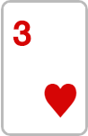 | 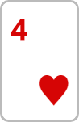 | 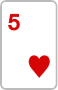 |  |
| ------ | ------ | ------ | ------ | ------ |

### Four of a kind `Group Range: [700, 800)`

For the other cases ( including `Four of a kind` ) we'll sort descending the duplicates cards according to their amount.

**Edge case:**

The four of a kind is placed in the table's cards, in that case we need to check in each player for the 5th card, 
but we can't simply check for the highest card, since if the `Four of a kind` is the highest card, then we'll announce for a tie for no reason ( wrong calculation! )
Therefore, we'll use our method: `EvaluateRankByHighestCards()` to ignore the `Four of a kind`'s value and check for the highest card excluding it.

### Full House `Group Range: [600, 700)`

Main check: if duplicates.Count(), it can occur for example if we have 22 and 55,, and the 2nd condition is if the count of duplicates is 3 and then 2, so it will happen in case of 22255 for example.

**Edge cases:**

1. It is possible to have 2 pairs of 3, for example: ( remember that we have 7 cards to check )


|  |  | 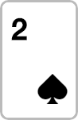 | 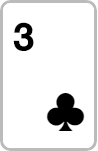 | 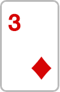 |  |
| ------ | ------ | ------ | ------ | ------ | ------ |

In that case evaluate what is better: 333 22 or 222 33 and will take the max score among them.

2. One pair of 3 and two pairs of 2, for example:

|  |  | 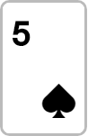 | 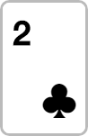 |  |  |  |
| ------ | ------ | ------ | ------ | ------ | ------ | ------ |

In that case we'll evaluate what is better: the Pair of the 3 ( 555 ) with the first pair ( 22 ) or the second: 555 44 and take the max score among them.

### Flush `Group Range: [500, 600)`

We walk through every `SevenCards.Where(x => x[1].Equals(suit));` which means every group of cards collected by their suit, and if the count is bigger or equals to 5, we'll save it as `suitCards` and we will evaluate the card by: 500 + `EvaluateRankByHighestCards()` method on this list.


**Edge case:**

We can have a list of grather than 5 in that case since the cards already sorted by their value, we'll take only the last 5 cards by doing: `var suitCardsResult = suitCards.Skip(suitCardsLen - 5).ToList();`

### Straight `Group Range: [400, 500)`

We already have a variable from the pre-evaluation that saved for us the sequence max count, and if it's bigger or equals to 5 we'll check of the highest card in the sequence to evaluate the rank's hand:

 `rank = 400 + (double)seqMaxValue / 14 * 99;`
 
 **Edge Case:**
 
 Same as Straight Flush, there might be this situation:
 
 
|  | 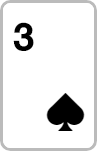 | 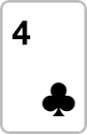 |  |  |
| ------ | ------ | ------ | ------ | ------ |

In that case we'll refer this cards as Straight with seqMaxValue = 5.

### Three of a kind `Group Range: [300, 400)`

We will check if duplicates.Count >= 1 and that the duplicates amount is 3.

Now the calculation is:

`300 + DuplicatedCardValue / 14 * 50 + EvaluateRankByHighestCards(SevenCards, Ignore: DuplicatedCardValue)`

The math behind: We need to make a formula so no matter how small is the Three of a kind, it will win others with smaller three of a kind, for example:

If I have: 555 2 3 and someone has 333 A K, even though my A and K are really big, I'll lose. and we can achieve that by doing DuplicatedCardValue / 14 * 50 that even the smallest number: `(duplicatedCardValue: 2 / 14 * 50)` will be bigger than these A and K.

### Two Pairs `Group Range: [200, 300)`

We'll check for two duplicates. and evaluate the score accordingly. 

**Edge Case:**

There are 3 pairs of two, in that case we'll choose the two highest pairs.

### Pair `Group Range: [100, 200)`

There's only one pair, otherwise we would have entered the "Two Pair" case, so we'll just evaluate the rank with this pair card value and the rest of the cards with `EvaluateRankByHighestCards()` method.

### High Card `Group Range: [0, 100)`

Otherwise, if we couldn't find anything else, we'll just `EvaluateRankByHighestCards()` the rest of the cards.

# Main and Side Pots algorithm and money spreading

## `CalculateMainAndSidePots()` Method

Imagine the following situation:
We have three players: A, B and C.

The three players make an all-in when:
- A makes an all-in when he has $ 25
- B makes an all-in when he has $ 50
- C makes an all-in when he has $ 100

This means that right now there is $ 175 on the table and we have to think how to split it between the players.

So first thing to do, it calculate the Main and Side Pots as follows:

1. Consider a new variable `X` as:

<p align="center">
  
</p>

The minimum among the pots of the players.
In our example `X = $ 25`.

2. Let's start a new variable `sum` initialized to 0. And take from each player `X` money and put it into `sum`.
Which means at this point `sum = $ 75` and the current player status is:
* A - $ 0
* B - $ 25
* C - $ 75

Also, we took money from all three players, so the money was contested by A, B and C.

(Since we took `X` from each player)

3. We will repeat this process recursively until we remain in a state where:
  Only one player has a sum greater than zero or they all have a sum equal to zero.
  
So in the next iteration `x = $ 25` once again, and we'll take money from each available player:
`sum = $ 50` and it was contested by B and C.
and player status:

* A - $ 0
* B - $ 0
* C - $ 50

now we are in a stop condition: only one player has money, player C and we going to give him back the rest of the money.

So in the end of method we managed to gain this information:

```
{
  Name: Main Pot,
  Money: 75$,
  Contested By: [Player A, Player B, Player C]
},
{
  Name: Side Pot 1,
  Money: 50$,
  Contested By: [Player B, Player C]
}
```

There are several situations:

1. **Player A wins:** in that case he will take the Main pot and we'll check who has better hand player B or player C for the Side Pot 1.
2. **Player B Wins:** He'll take both Main and Side pots.
3. **Player C wins:** He'll take both Main and Side pots.

## Full Example & `SpreadMoneyToWinners()` method explanation

This method uses two previous methods that we explained: in both `CalculateMainAndSidePots` and `GetPlayerHandRank`, and both of them extract the racial data on who wins each side pot.

Let's take a look on full example:

We have 4 players and this is their Hands and the Table Cards:

***Table Cards***:

| 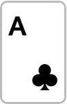 | 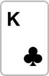 | 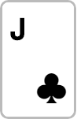 | 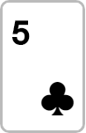 | 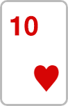 |
| ------ | ------ | ------ | ------ | ------ |

***Players Cards***:

| Player 1 | Player 2 | Player 3 | Player 4 |
| ------ | ------ | ------ | ------ |
|  |  |  |  |
| 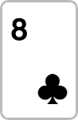 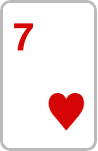 |   | 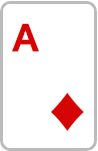 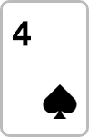 | 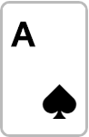  |
| All-in: 25 $ | All-in: 50 $ | All-in: 100 $ | All-in: 100 $ |

The results will be:

| `GetPlayerHandRank()` grouped by results | `CalculateMainAndSidePots()` results |
| ------ | ------ |
| 500.850 - `[Player 1]` - Flush<br />280.813 - `[Player 3, Player 4]` - Pair<br />261.593 - `[Player 2]` - Pair | Main Pot - 100 $ - `Contested by: [Player 1, Player2, Player3, Player4]`<br />Side Pot 1 - 75$ - `Contested by: [Player 2, Player 3, Player 4]`<br />Side Pot 2 - 100$ - `Contested by: [Player 3, Player 4]` |

Consider the left column results ( player hand rank groupped by sored by the hand rank ) as `PlayersHand`<br />
Consider the right column results ( Main and Side Pots ) as `SidePots`

What we should do in order to get the final results is to iterate each PlayersRank item intersect with each non-occuppied SidePot:

<p align="center">
  
</p>

For example, in the first iterate we have 500.850 and it contains Player1, and we are going to intersect it with every non-occupied SidePot, which is the "Main Pot" only.

Then, in the next iterate280.813 that contains Player3 and Player4 with:
- Main pot is already occupied, so we won't check it out.
- Side Pot 1 - There's a match: Both Player3 and Player4 will be in this side pot.
- Side Pot 2 - There's a match: Both Player3 and Player4 will be in this side pot.

Each player will have: `SidePotAmount / Winners.Count()`

No more non-occupied side pots, hence, we can stop here.

Final results:

```
{
  Main Pot,
  100 $,
  Winners: [Player 1]
  Each player will get: 100$
}
{
  Side Pot 1,
  75 $,
  Winners: [Player 3, Player 4]
  Each player will get: 37.5$
}
{
  Side Pot 2,
  100 $,
  Winners: [Player 3, Player 4]
  Each player will get: 50$
}
```


## Built and Designed With

* [flaticon](https://www.flaticon.com/) - Icon made by Freepik from www.flaticon.com


## Authors

* **Daniel Paz** - *Whole Project* - [Profile](https://github.com/DanielPaz6)
